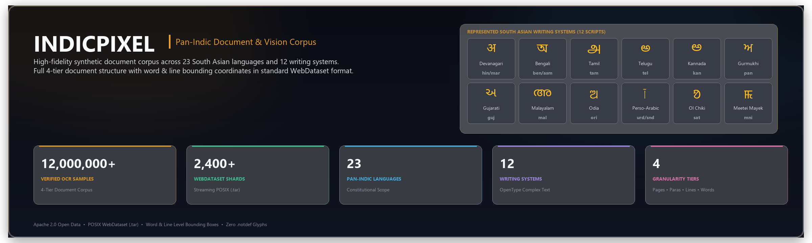

<div align="center">



<br/>

[](https://huggingface.co/datasets/Faizaniqbal/IndicOCR)
[](https://opensource.org/licenses/Apache-2.0)
[-f59e0b.svg?style=for-the-badge)](https://github.com/webdataset/webdataset)
[](https://pytorch.org/)
[](https://huggingface.co/datasets/Faizaniqbal/IndicOCR)
[](https://huggingface.co/datasets/Faizaniqbal/IndicOCR)
[](https://huggingface.co/datasets/Faizaniqbal/IndicOCR)
[](https://huggingface.co/datasets/Faizaniqbal/IndicOCR)

**A large-scale, high-fidelity synthetic Document AI & OCR benchmark spanning 23 Pan-Indic languages and 12 distinct writing systems.**

</div>

---

## 1. Overview

**IndicOCR (IndicPixel)** is a large-scale, multilingual Optical Character Recognition (OCR) and Document AI benchmark purpose-built for the South Asian linguistic ecosystem. Spanning **all 22 Eighth Schedule Constitutional Languages of India plus Bhojpuri**, the dataset covers **12 distinct writing systems** including Devanagari, Bengali-Assamese, Gurmukhi, Gujarati, Odia, Tamil, Telugu, Kannada, Malayalam, Extended Perso-Arabic (RTL), Ol Chiki, and Meetei Mayek.

### Why IndicOCR?
Traditional Indic OCR datasets frequently suffer from:
1. **Diacritic Truncation**: Top/bottom vowel signs (*matras*, *halants*, *bindis*) being clipped at canvas boundaries.
2. **Improper Complex Text Layout (CTL)**: Broken conjuncts (*samyuktaksharas*) and half-forms from naive fallback rasterizers.
3. **Sterile Renders**: Synthetic datasets lacking authentic degradation physics (photostat artifacts, ink bleed, non-uniform paper textures, shadows).

IndicOCR resolves these foundational challenges by combining **native HarfBuzz OpenType shaping**, font-level vertical metric padding, and an Indian document degradation DAG with 54 physical print, substrate, and sensor operators.

---

## 2. Dataset Specifications

* **Verified Volume:** **13,250,000 paired samples** packaged into **2,650 standardized WebDataset shards** (`.tar`), with 5,000 samples per shard.
* **Complex Text Layout (CTL) Guarantee:** Shaped with `uharfbuzz` with explicit script and direction (`ltr` / `rtl`), mathematically enforcing zero Glyph ID 0 (`.notdef` tofu boxes).
* **Diacritic Ownership Gate:** Dynamic vertical zone calculation ensures 100% of ascenders, body zones, and descenders lie strictly within canvas boundaries.
* **4-Tier Structural Granularity Matrix:**
  * **Tier 1: Full-Page Document Spreads (2%)** — Multi-column administrative gazettes, broadsheet newspapers, and literary journals with word-level bounding boxes.
  * **Tier 2: Multi-Line Paragraph Blocks (13%)** — Wrapped multi-line natural reading sequences.
  * **Tier 3: Reading Lines (55%)** — Core continuous text sentences with token-level bounding coordinates.
  * **Tier 4: Isolated Tokens & Complex Conjuncts (30%)** — Rare conjunct dictionaries, ligatures, numerals, and single words.
* **Master 54-Operator Degradation Engine:** 12.5% clean digital baseline scans, 87.5% realistic physical degradation across 5 distinct categories (paper substrates, print voiding, ink bleed, ancient manuscript wear, optical/sensor transformations).

---

## 3. Language Portfolio & Direct Hugging Face Partitions

Explore or stream individual language partitions directly on Hugging Face:

| Language | Script | ISO Code | Verified Samples | POSIX Shards | Hugging Face Partition |
| :--- | :--- | :---: | :---: | :---: | :--- |
| **Hindi** | Devanagari (`Deva`) | `hin` | 1,000,000 | 200 | [Explore `data/hindi/` ↗](https://huggingface.co/datasets/Faizaniqbal/IndicOCR/tree/main/data/hindi) |
| **Urdu** | Extended Arabic RTL (`Arab`) | `urd` | 1,000,000 | 200 | [Explore `data/urdu/` ↗](https://huggingface.co/datasets/Faizaniqbal/IndicOCR/tree/main/data/urdu) |
| **Bengali** | Bengali (`Beng`) | `ben` | 1,000,000 | 200 | [Explore `data/bengali/` ↗](https://huggingface.co/datasets/Faizaniqbal/IndicOCR/tree/main/data/bengali) |
| **Tamil** | Tamil (`Taml`) | `tam` | 1,000,000 | 200 | [Explore `data/tamil/` ↗](https://huggingface.co/datasets/Faizaniqbal/IndicOCR/tree/main/data/tamil) |
| **Marathi** | Devanagari (`Deva`) | `mar` | 1,000,000 | 200 | [Explore `data/marathi/` ↗](https://huggingface.co/datasets/Faizaniqbal/IndicOCR/tree/main/data/marathi) |
| **Telugu** | Telugu (`Telu`) | `tel` | 500,000 | 100 | [Explore `data/telugu/` ↗](https://huggingface.co/datasets/Faizaniqbal/IndicOCR/tree/main/data/telugu) |
| **Gujarati** | Gujarati (`Gujr`) | `guj` | 500,000 | 100 | [Explore `data/gujarati/` ↗](https://huggingface.co/datasets/Faizaniqbal/IndicOCR/tree/main/data/gujarati) |
| **Kannada** | Kannada (`Knda`) | `kan` | 500,000 | 100 | [Explore `data/kannada/` ↗](https://huggingface.co/datasets/Faizaniqbal/IndicOCR/tree/main/data/kannada) |
| **Malayalam** | Malayalam (`Mlym`) | `mal` | 500,000 | 100 | [Explore `data/malayalam/` ↗](https://huggingface.co/datasets/Faizaniqbal/IndicOCR/tree/main/data/malayalam) |
| **Odia** | Odia (`Orya`) | `ori` | 500,000 | 100 | [Explore `data/odia/` ↗](https://huggingface.co/datasets/Faizaniqbal/IndicOCR/tree/main/data/odia) |
| **Punjabi** | Gurmukhi (`Guru`) | `pan` | 500,000 | 100 | [Explore `data/punjabi/` ↗](https://huggingface.co/datasets/Faizaniqbal/IndicOCR/tree/main/data/punjabi) |
| **Assamese** | Bengali-Assamese (`Beng`) | `asm` | 500,000 | 100 | [Explore `data/assamese/` ↗](https://huggingface.co/datasets/Faizaniqbal/IndicOCR/tree/main/data/assamese) |
| **Nepali** | Devanagari (`Deva`) | `nep` | 500,000 | 100 | [Explore `data/nepali/` ↗](https://huggingface.co/datasets/Faizaniqbal/IndicOCR/tree/main/data/nepali) |
| **Sanskrit** | Devanagari (`Deva`) | `san` | 500,000 | 100 | [Explore `data/sanskrit/` ↗](https://huggingface.co/datasets/Faizaniqbal/IndicOCR/tree/main/data/sanskrit) |
| **Santali** | Ol Chiki (`Olck`) | `sat` | 500,000 | 100 | [Explore `data/santali/` ↗](https://huggingface.co/datasets/Faizaniqbal/IndicOCR/tree/main/data/santali) |
| **Manipuri** | Meetei Mayek (`Mtei`) | `mni` | 500,000 | 100 | [Explore `data/manipuri/` ↗](https://huggingface.co/datasets/Faizaniqbal/IndicOCR/tree/main/data/manipuri) |
| **Sindhi** | Extended Arabic RTL (`Arab`) | `snd` | 500,000 | 100 | [Explore `data/sindhi/` ↗](https://huggingface.co/datasets/Faizaniqbal/IndicOCR/tree/main/data/sindhi) |
| **Bodo** | Devanagari (`Deva`) | `brx` | 500,000 | 100 | [Explore `data/bodo/` ↗](https://huggingface.co/datasets/Faizaniqbal/IndicOCR/tree/main/data/bodo) |
| **Bhojpuri** | Devanagari (`Deva`) | `bho` | 500,000 | 100 | [Explore `data/bhojpuri/` ↗](https://huggingface.co/datasets/Faizaniqbal/IndicOCR/tree/main/data/bhojpuri) |
| **Kashmiri** | Extended Arabic RTL (`Arab`) | `kas` | 500,000 | 100 | [Explore `data/kashmiri/` ↗](https://huggingface.co/datasets/Faizaniqbal/IndicOCR/tree/main/data/kashmiri) |
| **Konkani** | Devanagari (`Deva`) | `gom` | 250,000 | 50 | [Explore `data/konkani/` ↗](https://huggingface.co/datasets/Faizaniqbal/IndicOCR/tree/main/data/konkani) |
| **Maithili** | Devanagari (`Deva`) | `mai` | 250,000 | 50 | [Explore `data/maithili/` ↗](https://huggingface.co/datasets/Faizaniqbal/IndicOCR/tree/main/data/maithili) |
| **Dogri** | Devanagari (`Deva`) | `doi` | 250,000 | 50 | [Explore `data/dogri/` ↗](https://huggingface.co/datasets/Faizaniqbal/IndicOCR/tree/main/data/dogri) |
| **TOTAL** | **12 Writing Systems** | **23 Langs** | **13,250,000** | **2,650** | [**Browse All Partitions on Hugging Face ↗**](https://huggingface.co/datasets/Faizaniqbal/IndicOCR/tree/main/data) |

---

## 4. Structural Specification & Annotation Format

Each sample is packaged inside standardized WebDataset `.tar` archives containing paired lossless image files (`.webp`) and comprehensive metadata descriptors (`.json`):

```json
{
  "sample_key": "kan_0008644",
  "tier": "Tier_2_Paragraph",
  "lang": "kan",
  "script": "Knda",
  "font_name": "BalooTamma2-Regular.ttf",
  "is_clean": false,
  "canvas_size": [669, 213],
  "text": "ಅದನ್ನು ತಂದು ಶ್ರೀನಿವಾಸನಿಗೆ ಕೊಡುತ್ತಾಳೆ. ಅಂಗಡಿಗೆ ಹಿಂದಿರುಗಿ\nಬಂದ ಶ್ರೀನಿವಾಸ ಡಬ್ಬಿಯನ್ನು",
  "tokens": [
    {"text": "ಅದನ್ನು", "bbox": [24, 16, 110, 68]},
    {"text": "ತಂದು", "bbox": [122, 16, 185, 68]},
    {"text": "ಶ್ರೀನಿವಾಸನಿಗೆ", "bbox": [198, 16, 360, 68]}
  ],
  "token_count": 22,
  "applied_augmentations": [
    "#04 Substrate: notebook_ruled",
    "#40 Keystone Tilt",
    "#13 Capillary Ink Bleed"
  ]
}
```

### Metadata Fields

| Field Name | Type | Description |
| :--- | :---: | :--- |
| `sample_key` | `string` | Unique globally indexed sample identifier across shards. |
| `tier` | `string` | Granularity tier (`Tier_1_FullPage`, `Tier_2_Paragraph`, `Tier_3_Line`, `Tier_4_Word`). |
| `lang` | `string` | ISO 639-3 three-letter language identifier. |
| `script` | `string` | ISO 15924 four-letter script identifier. |
| `font_name` | `string` | OpenType font family utilized for HarfBuzz shaping. |
| `canvas_size` | `[int, int]` | Canvas dimensions `[width, height]` in pixels. |
| `text` | `string` | Unicode NFC ground truth text transcription. |
| `tokens` | `list[dict]` | Token-level annotations with tight ink bounding boxes `[x0, y0, x1, y1]`. |
| `token_count` | `int` | Total count of recognized tokens/words in the sample. |
| `applied_augmentations` | `list[string]` | Chain of degradation operators applied from the 54-operator DAG. |

---

## 5. Distributed Streaming Quickstart (PyTorch / WebDataset)

IndicOCR shards stream directly into GPU memory over HTTP without local disk extraction:

```python
import webdataset as wds
from torch.utils.data import DataLoader

# Stream Kannada shards directly from Hugging Face Hub
shard_url = "https://huggingface.co/datasets/Faizaniqbal/IndicOCR/resolve/main/data/kannada/kan_train_{00000..00099}.tar"

dataset = (
    wds.WebDataset(shard_url, resampled=False, shardshuffle=True)
    .shuffle(1000)
    .decode("pil")
    .to_tuple("webp", "json")
)

dataloader = DataLoader(dataset, batch_size=32, num_workers=4)

for images, metadata in dataloader:
    # Forward pass to Vision-Language Model / TrOCR / Donut / LayoutLMv3
    pass
```

---

## 6. License

The IndicOCR dataset and benchmark documentation are released under the [Apache 2.0 License](LICENSE).

---

## 7. Citation

If you utilize IndicOCR in your research or applications, please cite:

```bibtex
@dataset{indicpixel_2026,
  author    = {Faizan Iqbal},
  title     = {IndicOCR: A Large-Scale Foundational Multilingual Document AI and OCR Benchmark for Pan-Indic Languages},
  year      = {2026},
  publisher = {Hugging Face},
  url       = {https://huggingface.co/datasets/Faizaniqbal/IndicOCR}
}
```
